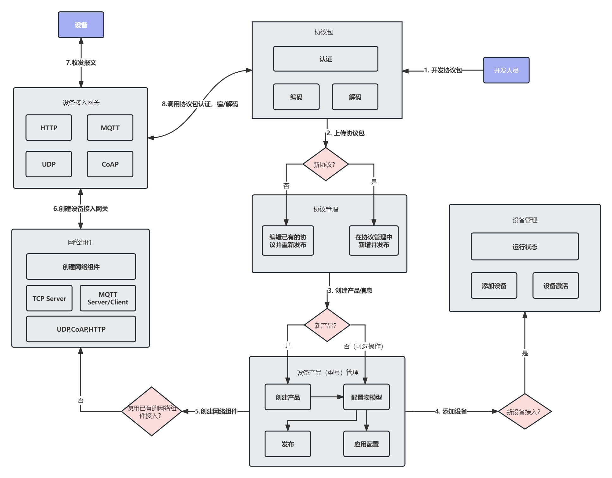
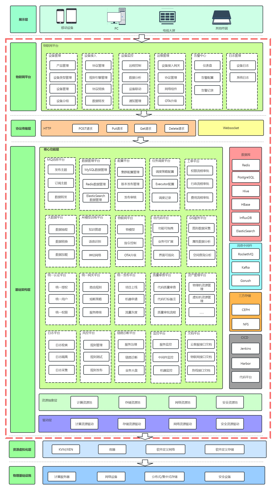
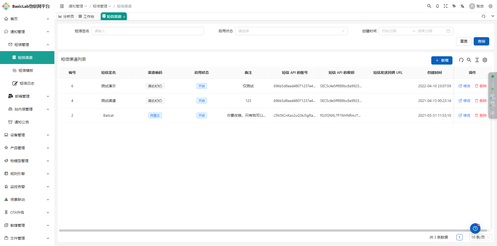
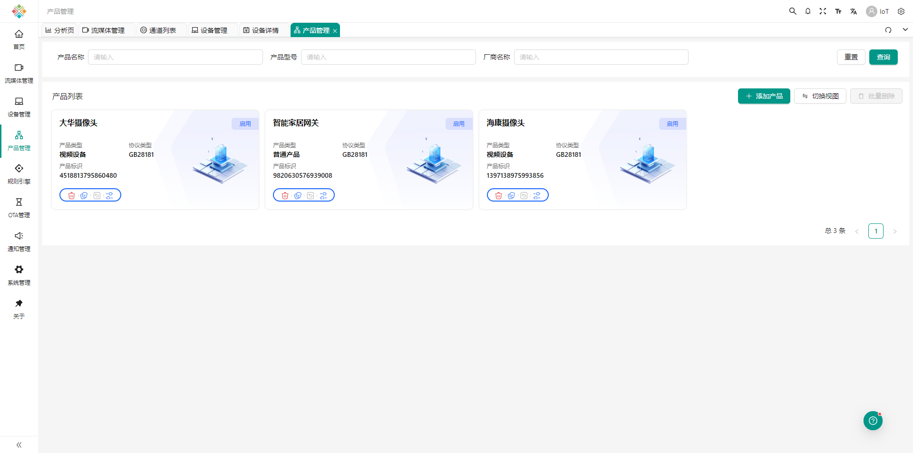
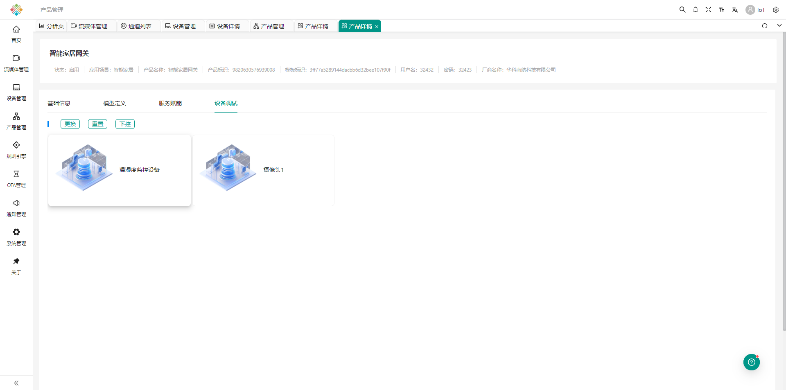
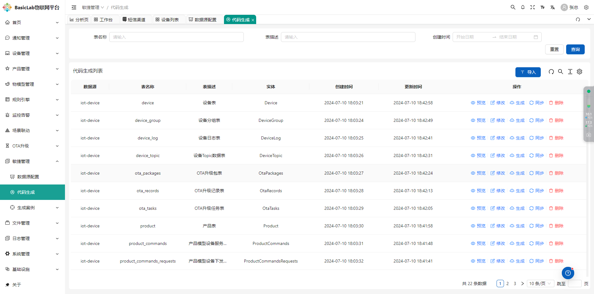
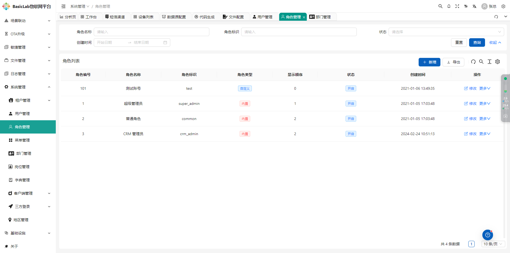
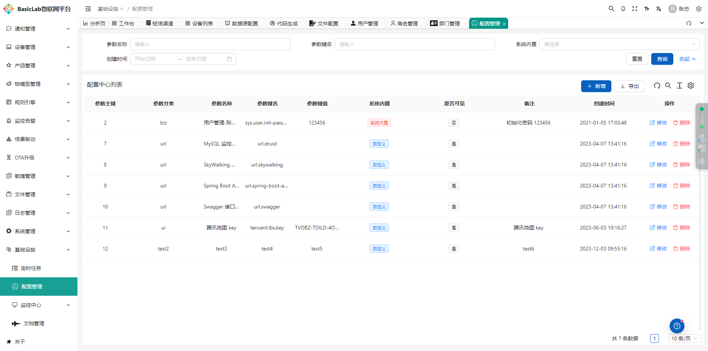
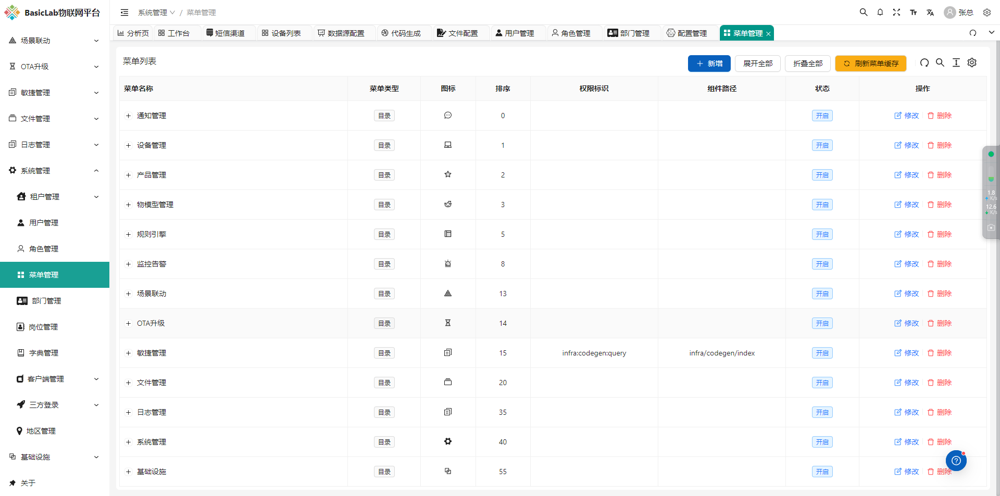
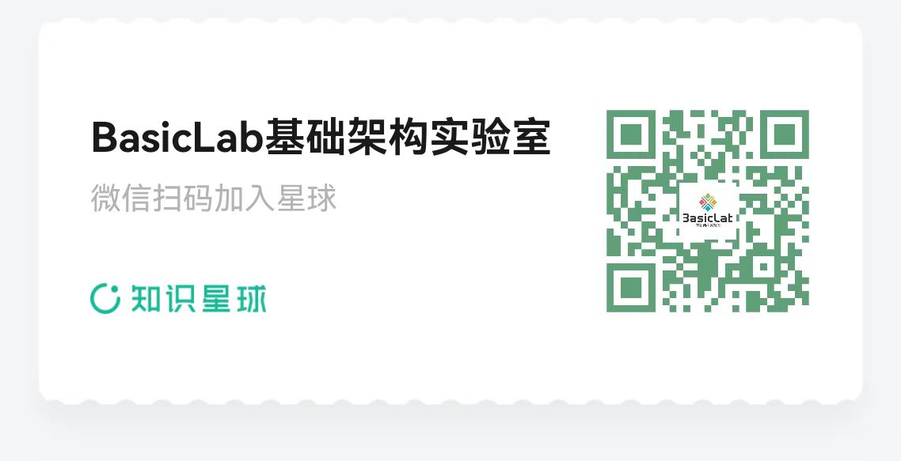

# BasicLab-IoT Platform

    

    
    
    
    

## Demo address (account/password in the communication group)
http://pro.basiclab.top:8888/

## The goal of BasicLab
The original intention of BasicLab was to enable traditional enterprises to complete the most cutting-edge digital upgrading and transformation in the shortest time, lowest cost, and fastest speed after integrating into the BasicLab full product ecosystem, which can help traditional enterprises complete digital industry upgrading.

## The Origin of BasicLab
BasicLab is guided by the National 2035 Vision Policy and was conceived three years ago. The entire product system will use seven development languages and is operated by individuals in their spare time. Its purpose is to help traditional enterprises complete the upgrading and transformation of the National 2035 digital industry at a lower cost, and achieve social goals.

## Open source of BasicLab
The BasicLab IoT platform is one of the many IoT platforms in the BasicLab infrastructure laboratory. It is an open-source IoT cloud platform built on SpringBoot and SpringCloud, aiming to provide a one-stop solution for device connection, data collection, processing, and analysis. This project uses PostgreSQL as a relational database to store core data and follows the Apache 2.0 license agreement, encouraging community contribution and business friendly use.

## Product System Planning for BasicLab
The BasicLab product system plan includes the following content:

    

## BasicLab-IoT Internet of Things Platform
The BasicLab-IoT platform, as one of the many products in the BasicLab infrastructure laboratory, is an open-source IoT cloud platform built on SpringBoot and SpringCloud, aimed at providing a one-stop solution for device connectivity, data collection, processing, and analysis. This project uses PostgreSQL as a relational database to store core data and follows the Apache 2.0 license agreement, encouraging community contribution and business friendly use.

### BasicLab-IoT architecture diagram

### BasicLab full product system hierarchical architecture diagram

## Introduction

BasicLab-IoT Platform is one of the many products in the BasicLab Infrastructure Laboratory. It is an open-source IoT cloud platform built on SpringBoot and SpringCloud, aiming to provide a one-stop solution for device connectivity, data collection, processing, and analysis. This project uses PostgreSQL as a relational database to store core data and follows the Apache 2.0 license agreement, encouraging community contribution and business friendly use.

## Technology stack
-- Adopting a front-end and back-end separation mode, the front-end framework VUE.
-- The backend adopts Spring Boot Spring Cloud & Alibaba。
-- The device gateway is based on Emqx Netty、Reactor3、Reactor-netty。
-- Choose Nacos for registration center and configuration center, and use Redis for permission authentication.
-- Select Sentinel for flow control framework and Seata for distributed transactions.
-- The temporal database adopts TDengine's open-source and efficient IoT big data platform to handle massive IoT data writing and load queries.

## Function List
-- System management: user management, role management, menu management, department management, position management, dictionary management, parameter setting, notification and announcement, log management
-- System monitoring: online users, scheduled tasks, Sentinel console, Nacos console, Admin console, task scheduling management
-- System tools: form construction, code generation, system interfaces
-- Device integration: device management, sub device management, product management, protocol management, rule engine, object model
-- Rule engine message forwarding: supports KAFKA nodes, HTTP nodes, PREDICATE nodes, ROCKET-MQ nodes, RABBIT-MQ nodes, MYSQL nodes, MQTT nodes, TOPIC nodes, and LOG nodes (added to knowledge planet acquisition)

## Technology stack
- Backend: SpringBoot, SpringCloud
- Database: PostgreSQL
- Protocol: HTTP/HTTPS/MQTT/ModBus/SIP
- License: Apache License 2.0

## Environmental requirements
- Java 8+
- Maven 3.6+
- PostgreSQL 13+

## System screenshot

    
    
    
    
    
    
    
    
    
    
    
    
    
    
    
    
    
    
    
    
    
    
    
    
    
    
    
    
    
    
    
    

## Contact information(The SQL script for BasicLab IoT IoT platform is in the group, and it is not easy for individuals to open source. Please click on STAR. Thank you.)
If you need to communicate more about the BasicLab IoT open source platform content, or if you want to learn about the full set of BasicLab infrastructure products, you can join the group through WeChat:

    

## Documents and Support
The Knowledge Planet documentation includes detailed development guides, API documentation, and deployment tutorials. If needed, you can join the planet yourself (the documentation can be purchased if needed, treat the author to a meal)

## issues(Welcome everyone to provide valuable feedback)
[issues](https://github.com/AndyWebJava/basiclab-iot/issues)

## Welcome to submit PR
[pr->feat/contrbute](https://github.com/AndyWebJava/basiclab-iot/pulls)

## License (Open Source Protocol)
[Apache License, Version 2.0](LICENSE)

## Copyright usage instructions
The BasicLab-IoT platform follows the Apache License, Version 2.0 (LICENSE) protocol. Commercial use is allowed, but class author and copyright information must be retained.