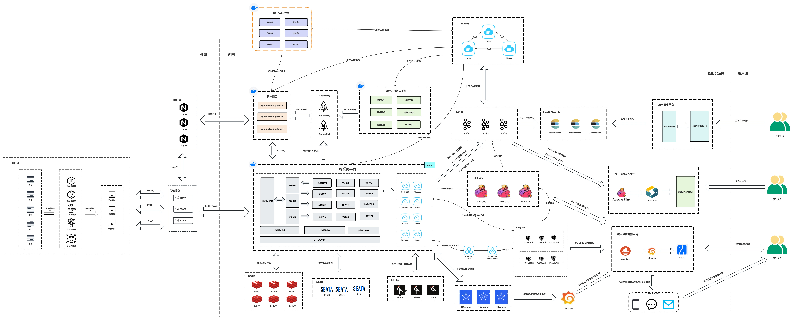
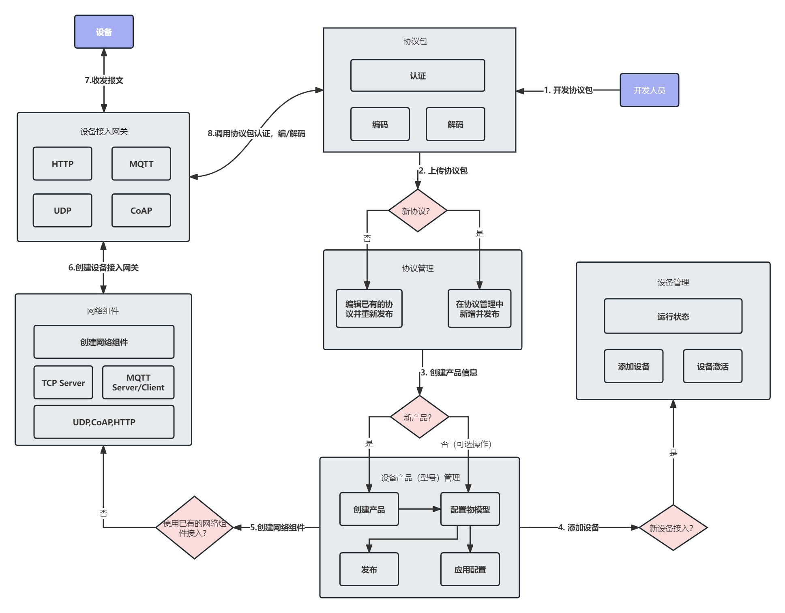
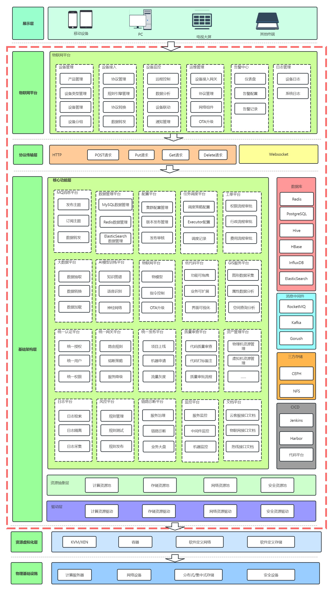
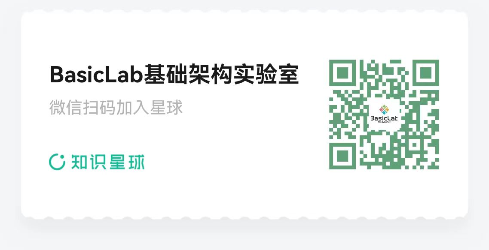

# BasicLabIoT物联网平台

    

### BasicLabIoT架构图

### BasicLab全产品体系层次架构图

## Introduction

BasicLabIoT Platform is one of the many products in the BasicLab Infrastructure Laboratory. It is an open-source IoT cloud platform built on SpringBoot and SpringCloud, aiming to provide a one-stop solution for device connectivity, data collection, processing, and analysis. This project uses PostgreSQL as a relational database to store core data and follows the Apache 2.0 license agreement, encouraging community contribution and business friendly use.

## Technology stack
-- Adopting a front-end and back-end separation mode, the front-end framework REACT.
-- The backend adopts Spring Boot Spring Cloud & Alibaba。
-- The device gateway is based on Emqx Netty、Reactor3、Reactor-netty。
-- Choose Nacos for registration center and configuration center, and use Redis for permission authentication.
-- Select Sentinel for flow control framework and Seata for distributed transactions.
-- The temporal database adopts TDengine's open-source and efficient IoT big data platform to handle massive IoT data writing and load queries.

## Function List
-- System management: user management, role management, menu management, department management, position management, dictionary management, parameter setting, notification and announcement, log management
-- System monitoring: online users, scheduled tasks, Sentinel console, Nacos console, Admin console, task scheduling management
-- System tools: form construction, code generation, system interfaces
-- Device integration: device management, sub device management, product management, protocol management, rule engine, object model
-- Streaming media: national standard cascading, streaming equipment, split screen monitoring, channel management, push streaming, pull streaming, SIP signaling services (added to knowledge planet acquisition)
-- Rule engine message forwarding: supports KAFKA nodes, HTTP nodes, PREDICATE nodes, ROCKET-MQ nodes, RABBIT-MQ nodes, MYSQL nodes, MQTT nodes, TOPIC nodes, and LOG nodes (added to knowledge planet acquisition)

## Technology stack
- Backend: SpringBoot, SpringCloud
- Database: PostgreSQL
- Protocol: HTTP/HTTPS/MQTT/ModBus/SIP
- License: Apache License 2.0

## Environmental requirements
- Java 8+
- Maven 3.6+
- PostgreSQL 13+

## Business cooperation
### If you need to learn more about the professional version source code or seek business cooperation, you can contact me through the following methods
- WeChat: Miczhang88
- Email: andywebjava@163.com

##Documents and Support
###The document contains detailed development guides, API documentation, and deployment tutorials
###Source code for streaming media and rule engine function modules. After joining the planet for three days, please contact me and invite you to join the group to obtain the source code for this part (if you are not satisfied with the planet within three days, you can get a refund, and you can also pay for documents for three days in vain)

## issues(Welcome everyone to provide valuable feedback)
[issues](https://github.com/AndyWebJava/basiclab-iot/issues)

## Welcome to submit PR
[pr->feat/contrbute](https://github.com/AndyWebJava/basiclab-iot/pulls)

## License (Open Source Protocol)
[Apache License, Version 2.0](LICENSE)

## Copyright usage instructions
The BasicLabIoT IoT platform follows the Apache License, Version 2.0 (LICENSE) protocol. Commercial use is allowed, but class author and copyright information must be retained.