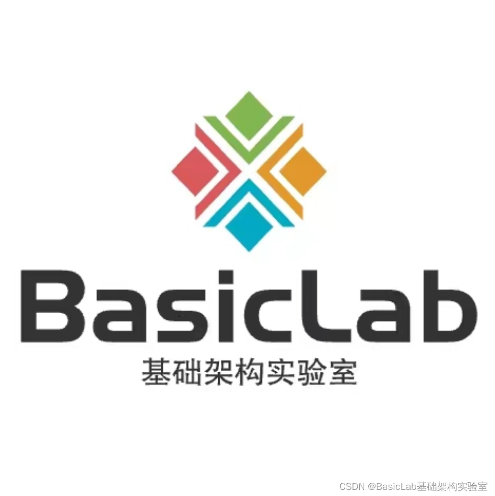
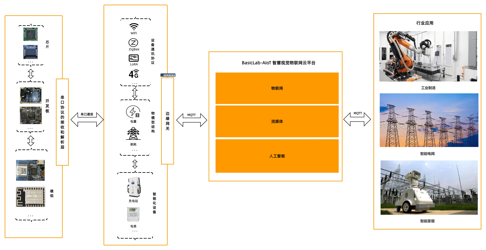
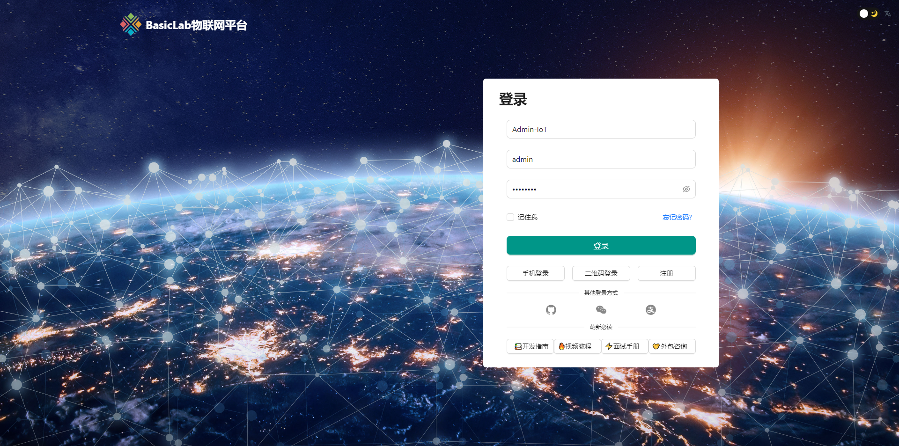
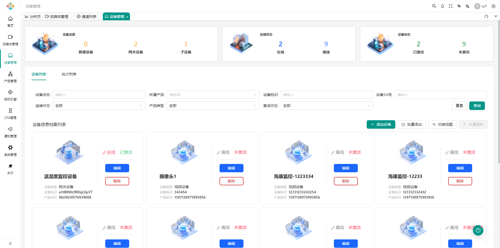
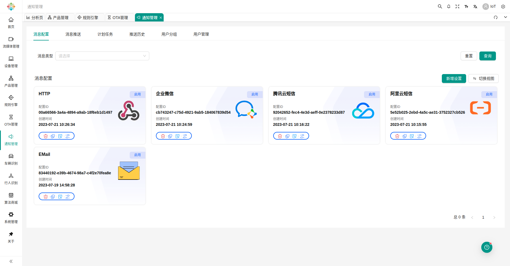
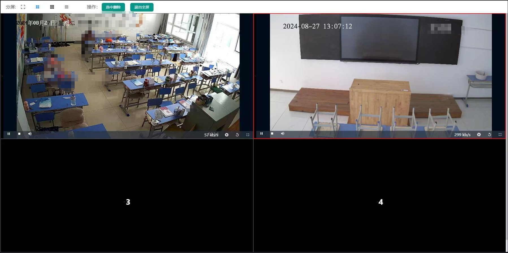
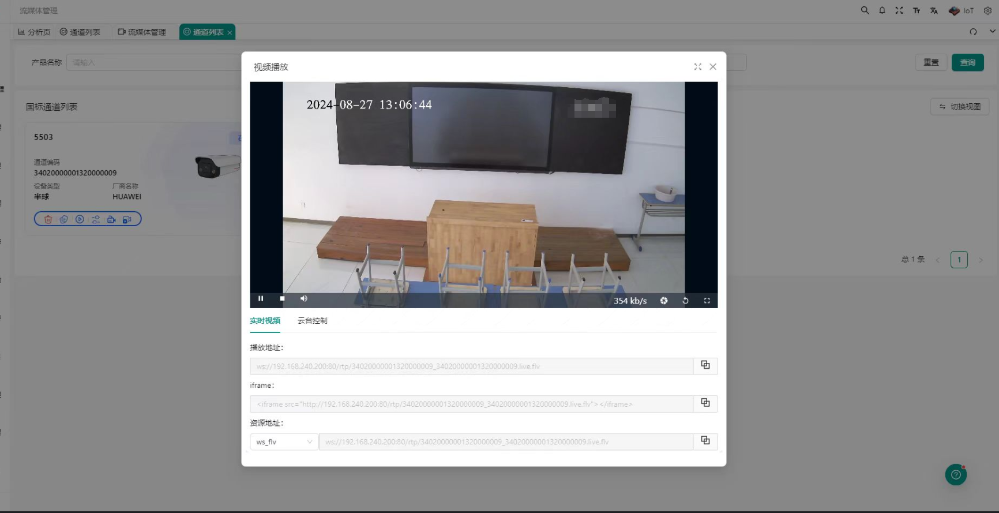
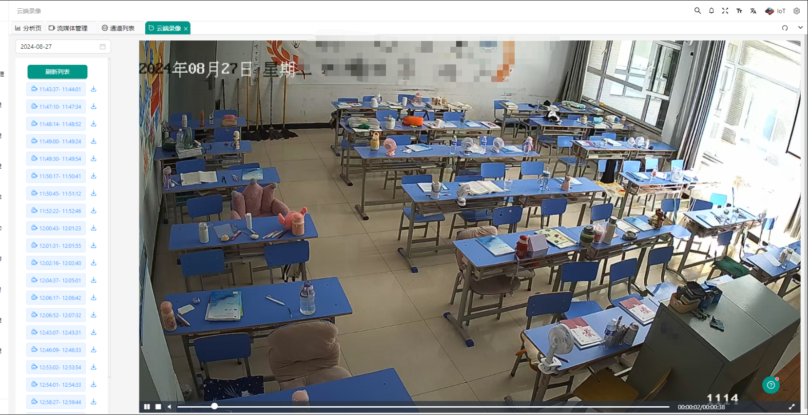
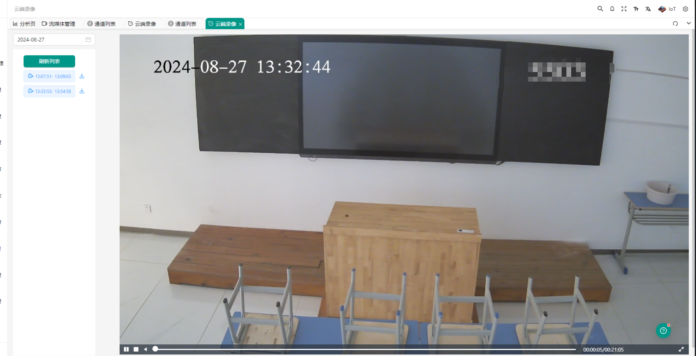
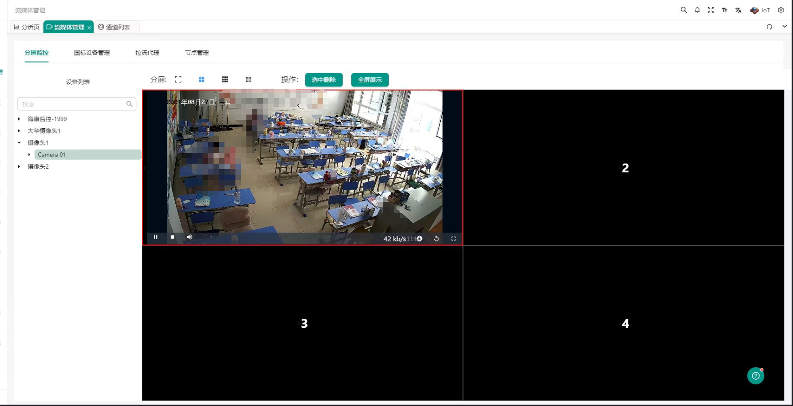

# BasicLab-AIoT 智慧视觉物联网云平台

    

    
    
    
    

# 全网首创开源：基于视频、物联、AI服务一体化解决方案
#### BasicLab-AIoT 引领创新智慧视觉物联网云平台，无界融合物联网技术、流媒体摄像头实时传输与AI人工智能解析，开启智能监控与数据分析新纪元。

#### 我们不仅实现了设备的互联互通，更通过深度整合高清流媒体视频流与前沿AI算法，为摄像头监控增添了智能化的眼睛——精准执行人脸与行为识别、行为分析、风险人员筛查及区域入侵检测，重新定义了安防监控、智能制造及智慧城市管理的标准。

#### 这一创举不仅提升了数据处理的实时性和精确度，还极大地扩展了物联网应用的边界，让“看见”与“理解”的能力遍布每一个物联网节点，真正意义上实践了物联网+流媒体+AI的无缝融合，推动数字化转型迈向更深更广的领域。

## 在线演示
地址：http://pro.basiclab.top:8888/
账号：admin
密码：admin123

## 应用场景
#### 适用于智慧校园、智慧城市、智慧安防、智慧农业、智慧医药、智慧工业、智慧能源、建筑工地安全、公共场所安防、智能停车场、智慧社区

## 联系方式
#### QQ交流群：🚀913496130

## Gitee同步仓库
https://gitee.com/vegetable-chicken-blog/BasicLab-AIoT

## 截图

    
    
    
    
    
    
    
    
    

## 功能列表
- [x] AI算法服务
  - [x] AI视频可疑人员检测（通过分析视频监控画面，自动识别不符合常规行为模式的个体）
  - [x] AI可疑人员检索（在大量视频资料中快速查找特定个体）
  - [x] AI人脸检索匹配（利用人脸识别技术，在数据库中比对人脸图像，用于身份验证、安防监控等）
  - [x] AI可疑行为识别（自动识别打架斗殴、遗留物检测、异常聚集、翻越围栏、禁区闯入等行为）
  - [x] AI车牌识别与追踪（自动识别车辆车牌信息，并能追踪车辆行驶轨迹，应用于交通管理、停车场管理等场景）
  - [x] AI农作物病虫害检测（通过图像识别技术，早期识别农作物上的病虫害迹象，辅助精准施药）
  - [x] AI自然灾害监测（分析卫星或地面观测数据，提前预警洪水、火灾、地震等自然灾害） 
  - [ ] 其他AI算法开发中... 
- [x] 设备接入服务
  - [x] 视频监控设备
  - [x] MQTT协议
  - [x] TCP协议
  - [x] UDP协议
  - [x] HTTP协议
  - [x] Modubus-TCP协议
  - [x] Modebus-RTP协议
  - [x] OPC UA协议
  - [x] Copa协议
  - [x] NB-IOT协议
  - [x] ZigBee协议
  - [x] LoRA协议
- [x] 设备管理
  - [x] 物模型
  - [x] 产品分类
  - [x] 产品模板
  - [x] 产品管理
  - [x] 协议管理
  - [x] 设备分组
  - [x] 设备列表
  - [x] 设备详情
  - [x] 运行状态
  - [x] 设备日志
  - [x] 设备服务
  - [x] 设备事件
  - [x] 设备告警
  - [x] 设备控制
  - [x] 实时监测
  - [x] 设备调试
  - [x] 数据采集
  - [x] 设备赋能
  - [x] 设备点播
  - [x] 设备录像
  - [x] 云端录像
  - [x] 设备通道
  - [x] 设备批次
  - [x] 设备分享
  - [x] 设备配网
  - [x] 设备模板
  - [x] 边缘端映射
  - [x] 设备诊断
  - [x] 设备功能
- [x] 规则引擎
  - [x] 事件监听（实时监测系统或设备产生的特定事件）
  - [x] 数据筛选（根据预设条件，从接收到的数据中筛选出有价值的信息）
  - [x] 消息存储（安全保存事件触发时的相关消息记录）
  - [x] 数据转发（将筛选后的数据或指令即时转发至其他系统或设备）
  - [x] 数据存储（长期存储关键数据）
  - [x] KAFKA节点（实现高吞吐量的实时流数据处理）
  - [x] HTTP节点（轻松与Web服务交互，进行API调用）
  - [x] PREDICATE节点（基于特定条件判断数据流走向）
  - [x] ROCKET_MQ节点（支持主流的消息队列协议，实现异步消息传递）
  - [x] RABBIT_MQ节点（支持主流的消息队列协议，实现异步消息传递）
  - [x] MYSQL节点（直接与关系型数据库交互，进行数据的读写操作）
  - [x] POSTGRESQL节点（直接与关系型数据库交互，进行数据的读写操作）
  - [x] INFLUXDB节点（专为时序数据设计的数据库接口，适合存储传感器等时间序列数据）
  - [x] TDENGINE节点（专为时序数据设计的数据库接口，适合存储传感器等时间序列数据）
  - [x] MQTT节点（适用于物联网的轻量级消息协议，特别适合资源受限设备）
  - [x] TOPIC节点（在消息系统中用于组织和过滤消息的逻辑实体）
  - [x] LOG节点（记录重要事件或数据流日志，便于调试和审计）
  - [x] DEBUG节点（为开发者提供调试信息，加速问题定位）
- [x] 场景联动
  - [x] 规则编排（允许用户自定义设备间的逻辑关系，实现智能化的家居或办公环境）
  - [x] 设备触发（当指定设备状态改变时，自动激活预设场景，如开门即开灯）
  - [x] 手动触发（用户可通过App或面板主动启动场景模式，适应即时需求变化）
  - [x] 定时触发（根据用户设定的时间表，自动执行场景变换，如晨起模式）
  - [x] 触发条件（支持多维度设置条件（如时间、环境参数），以精准控制场景切换）
  - [x] 动作编排（灵活组合多个操作形成连贯动作序列，提升自动化场景的丰富度）
  - [x] 设备联动（实现设备间智能协作，如温湿度传感器联动空调调节室内环境）
  - [x] 场景定制（用户可根据生活习惯，个性化配置专属场景模式）
  - [x] 离家模式（一键启动离家安全防护与节能设置，如关闭非必要电器、开启安防监控）
  - [x] 回家模式（自动准备欢迎回家场景，如开启灯光、调整适宜室温）
  - [x] 天气控制（根据天气预报自动调整家居环境，如雨天自动关闭窗户）
  - [x] 智能控制（综合运用上述特性，实现全面的智能家居或办公空间自动化）
  - [x] 设备告警（自动触发警告通知，如烟雾探测器报警时发送短信提醒）
- [x] 视频中心
  - [x] 集成化Web控制台（提供直观的操作界面，简化设备管理和系统配置流程）
  - [x] 广泛兼容与稳定性（确保与多类型设备无缝整合，维持系统运行的高效与稳定）
  - [x] 灵活设备接入管理（支持任意数量设备接入，仅受服务器性能限制，实现资源最大化利用）
  - [x] 高清视频预览与流控制（轻松切换主/子码流，适应不同监控场景需求）
  - [x] 云台操控自如（全方位控制摄像头转动、变焦，实现精细化监控）
  - [x] 录像回放与智能检索（便捷查询并播放录像，时间点播与下载功能一应俱全）
  - [x] 智能流量节省机制（无人观看时自动减少带宽消耗，优化资源使用）
  - [x] 实时设备信息更新（确保视频设备信息与状态同步，提升监控效率）
  - [x] 全天候监控体系（支持设备的离线与在线状态监控，保障监控连续性）
  - [x] 多协议流输出能力（直接提供多种流协议地址，便于快速接入与观看）
  - [x] 即插即用体验（无需额外登录或接口调用，一键直达监控画面）
  - [x] 国标通讯与流传输双保障（全面兼容UDP/TCP国标标准，强化系统互操作性）
  - [x] 精细查询与分类浏览（提供通道筛选、子目录查询工具，管理更加高效）
  - [x] 纯净视听体验（有效滤除背景噪音，保证观看质量）
  - [x] 精确时间同步（确保全网设备时间一致性，提升系统协同作业能力）
  - [x] 先进视频编码支持（流畅播放H264与H265编码视频，优化存储与传输效率）
  - [x] 报警系统高效联动（即时处理报警信息，无缝推送至前端，确保快速响应）
  - [x] 双向语音通讯（集成语音对讲功能，加强现场互动与指挥调度）
  - [x] 事件通知与订阅服务（灵活配置报警事件订阅与通知策略，定制化监控体验）
  - [x] 增强安全措施（支持设备独立密码与权限管理，加固系统安全防线）
  - [x] 国标级联扩展（实现多层级监控网络互联，构建大规模监控体系）
  - [x] 注册与心跳机制（确保设备持续在线，提升系统可用性）
  - [x] 通道管理优化（简便的通道选择与推送功能，提升操作便利性）
  - [x] 自适应流媒体配置（自动优化ZLM媒体服务配置，减少配置困扰）
  - [x] 智能负载均衡（多节点自动分配负载，确保流媒体服务高效稳定）
  - [x] UDP性能强化（启用多端口模式，显著提升UDP传输效率）
  - [x] 灵活部署选项（支持公网环境部署，适应多样化网络架构）
  - [x] 严格流与接口权限控制（实施推流与接口鉴权，加固数据安全）
  - [x] 云端录像存储（灵活录制与存档，支持远程预览与下载）
  - [x] 多样部署形态（支持jar/war包部署，适应云原生与传统环境）
  - [x] 跨域资源访问（无缝支持前后端分离部署，提升开发灵活性）
  - [x] 监控设备巡检（一键判断监控设备集群故障问题原因）
- [x] 数据可视化
    - [x] 大屏展示
    - [x] 数据分析
    - [x] 图层管理
    - [x] 基础组件
    - [x] 装饰组件
    - [x] 条形图组件
    - [x] 柱状图组件
    - [x] 折线图组件
    - [x] 面积图组件
    - [x] 饼图组件
    - [x] 进度图组件
    - [x] 散点图组件
    - [x] 玫瑰图组件
    - [x] 地图组件
    - [x] 自定义组件
- [x] 组态管理
    - [x] 组态编排
    - [x] 组态图库
    - [x] 组态图表
    - [x] 组态组件
    - [x] 组态模型
- [x] 移动端
    - [x] 设备实时监控（显示所有连接设备的当前状态，包括设备运行情况、关键指标和传感器数据）
    - [x] 设备控制面板（允许用户远程控制设备，如开关、参数调节等操作）
    - [x] 报警与通知（实时接收设备异常或预警通知）
    - [x] 设备管理（包括设备添加、删除、分组管理及设备详情查看等功能）
    - [x] 数据可视化（通过图表形式直观展示设备数据）
    - [x] 地理定位与地图视图（显示设备的实际地理位置，便于追踪与管理移动或分布式的设备）
    - [x] 场景自动化（配置和触发预设的场景模式，例如“离家模式”或“节能模式”）
    - [x] 能耗管理（监测并管理设备能源消耗，支持能耗分析报告）
    - [x] 历史数据查询（提供设备运行日志与数据记录的查询功能，支持按时间段筛选）
    - [x] 固件升级与维护（远程推送固件更新，管理设备维护计划）
    - [x] 用户权限管理（支持多用户访问，可分配不同的权限等级）
    - [x] 离线操作与同步（在无网络时仍能进行操作，随后自动同步数据）
    - [x] 语音控制集成（与智能语音助手集成，实现语音操控设备）
    - [x] API与第三方集成（支持与其它系统或应用的API对接，扩展平台功能）
- [x] 系统管理
  - [x] 用户管理
  - [x] 角色管理
  - [x] 菜单管理
  - [x] 部门管理
  - [x] 岗位管理
  - [x] 字典管理
  - [x] 参数设置
  - [x] 通知公告
  - [x] 日志管理
- [x] 系统监控
    - [x] 在线用户
    - [x] 定时任务
    - [x] 数据监控
    - [x] 服务监控
    - [x] 缓存监控
- [x] 系统工具
    - [x] 表单构建
    - [x] 代码生成
    - [x] 系统接口
- [ ] 开发中功能 ...

## 商用授权
项目采用AGPL3.0协议，可用于个人学习和使用，商业用途需要赞助项目，获得授权，并提供商业版本源码，赞助过的用户请下载商业版本源码。 
- 二开项目同样遵守AGPL3.0协议进行开源，可以向原作者申请授权
- 如果商业项目想转闭源，可以向原作者申请或者购买闭源授权