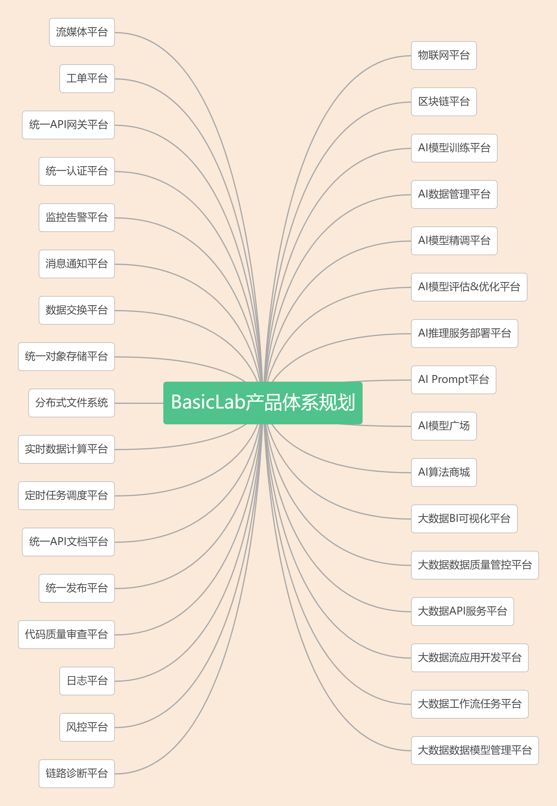

# BasicLab-IoT物联网平台

    

    
    
    
    

## 演示地址（账号/密码在交流群里）
http://pro.basiclab.top:8888/

## BasicLab的目标
BasicLab成立的初衷是，让传统企业在接入BasicLab全产品生态体系后，用最短的时间、最低的成本、最快的速度，完成最前沿的数字化升级转型，能帮助传统企业完成数字化产业升级。

## BasicLab的由来
BasicLab是以国家2035远景政策为指导，在三年前开始构思，全产品体系会使用到7种开发语言，是由个人利用业余时间运营的，其目的是帮助传统企业能够用较低的成本完成国家2035数字化产业升级和转型，实现社会价值和个人价值。

## BasicLab的开源
BasicLab目前是将BasicLab-IoT物联网平台单一产品分出开源版本贡献开源社区。

## BasicLab的产品体系规划
BasicLab产品体系规划包含以下内容：

    

## BasicLab-IoT物联网平台
BasicLab-IoT物联网平台作为BasicLab基础架构实验室众多产品中的物联网平台，它是一个基于SpringBoot与SpringCloud构建的开源物联网云平台，旨在为设备连接、数据采集、处理与分析提供一站式解决方案。本项目采用PostgreSQL作为关系型数据库存储核心数据，并遵循Apache 2.0许可协议，鼓励社区贡献与商业友好使用。

### BasicLab-IoT物联网平台架构图

### BasicLab全产品体系层次架构图

## 技术栈
1、采用前后端分离的模式，前端框架VUE。

2、后端采用Spring Boot、Spring Cloud & Alibaba。

3、设备网关基于Emqx、Netty、Reactor3、Reactor-netty。

4、注册中心、配置中心选型Nacos，权限认证使用Redis。

5、流量控制框架选型Sentinel，分布式事务选型Seata。

6、时序数据库采用TDengine开源、高效的物联网大数据平台、处理物联网海量数据写入与负载查询。

## 功能列表

1、系统管理：用户管理、角色管理、菜单管理、部门管理、岗位管理、字典管理、参数设置、通知公告、日志管理

2、系统监控：在线用户、定时任务、Sentinel控制台、Nacos控制台、Admin控制台、任务调度管理

3、系统工具：表单构建、代码生成、系统接口

4、设备集成：设备管理、子设备管理、产品管理、协议管理、规则引擎、物模型

5、规则引擎消息转发：支持KAFKA节点、HTTP节点、PREDICATE节点、ROCKET_MQ节点、RABBIT_MQ节点、MYSQL节点、MQTT节点、TOPIC节点、LOG节点

## 技术栈

- 后端：SpringBoot, SpringCloud
- 数据库：PostgreSQL
- 协议：HTTP/HTTPS
- 许可证：Apache License 2.0

## 环境需求
- Java 8+
- Maven 3.6+
- PostgreSQL 13+

## 系统截图

    
    
    
    
    
    
    
    
    
    
    
    
    
    
    
    
    
    
    
    
    
    
    
    
    
    
    
    
    
    
    
    

## 联系方式（BasicLab-IoT物联网平台的SQL脚本在群里，个人开源不易，恳请您点个STAR，谢谢您）
如需交流更多关于BasicLab-IoT物联网平台内容，或者想要了解全套BasicLab基础架构产品，可以通过微信入群：

    

## 文档与支持
知识星球文档包含详细的开发指南、API文档及部署教程，有需要可以自行加入星球（文档有需要可以购买，就当请作者吃个饭）

## issues(欢迎大家提出宝贵意见)

[issues](https://github.com/AndyWebJava/basiclab-iot/issues)

## 欢迎提交 pr

[pr->feat/contrbute](https://github.com/AndyWebJava/basiclab-iot/pulls)

## License(开源协议)

[Apache License, Version 2.0](LICENSE)

## 版权使用说明

BasicLab-IoT平台遵循 [Apache License, Version 2.0](LICENSE) 协议。 允许商业使用，但务必保留类作者、Copyright 信息。