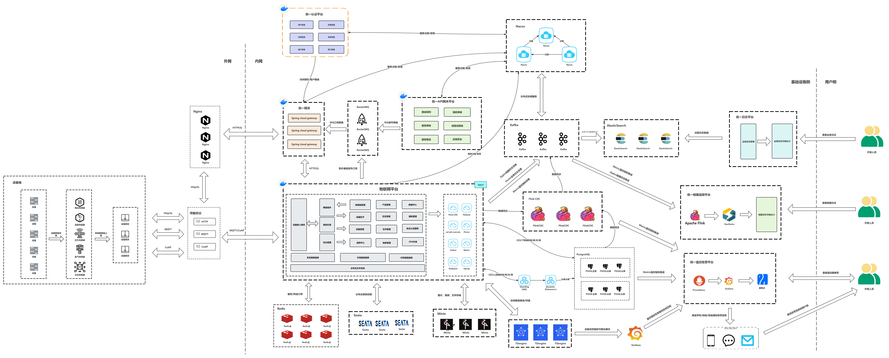
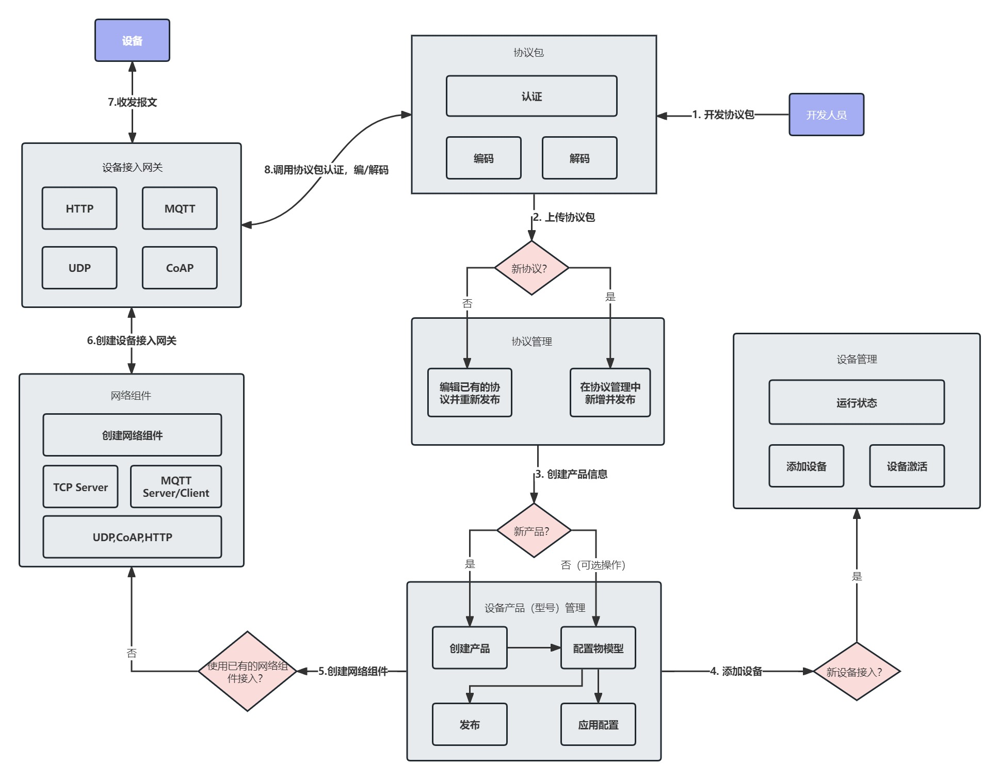
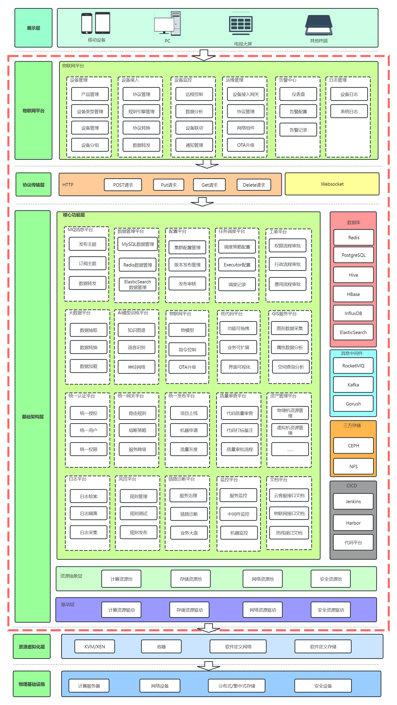
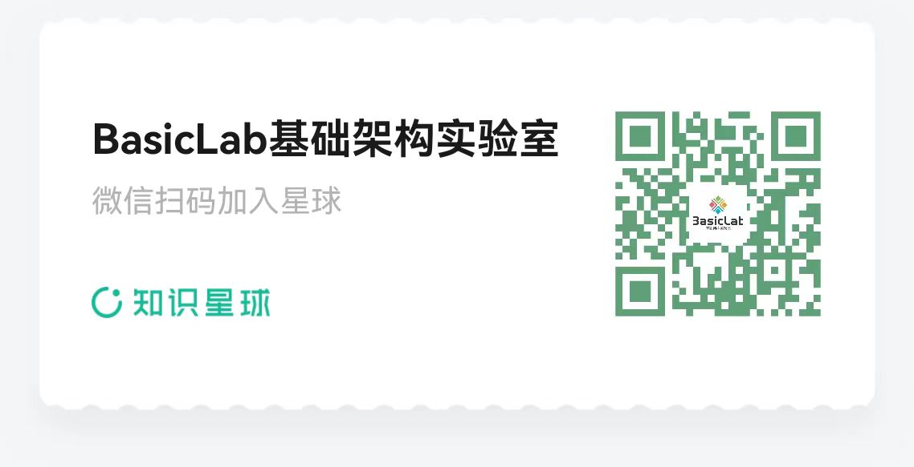

# BasicLabIoT物联网平台

    

    
    
    
    

### BasicLabIoT架构图

### BasicLab全产品体系层次架构图

## 简介

BasicLabIoT物联网平台作为BasicLab基础架构实验室众多产品中的一员，它是一个基于SpringBoot与SpringCloud构建的开源物联网云平台，旨在为设备连接、数据采集、处理与分析提供一站式解决方案。本项目采用PostgreSQL作为关系型数据库存储核心数据，并遵循Apache 2.0许可协议，鼓励社区贡献与商业友好使用。

## 技术栈
1、采用前后端分离的模式，前端框架VUE。

2、后端采用Spring Boot、Spring Cloud & Alibaba。

3、设备网关基于Emqx、Netty、Reactor3、Reactor-netty。

4、注册中心、配置中心选型Nacos，权限认证使用Redis。

5、流量控制框架选型Sentinel，分布式事务选型Seata。

6、时序数据库采用TDengine开源、高效的物联网大数据平台、处理物联网海量数据写入与负载查询。

## 功能列表

1、系统管理：用户管理、角色管理、菜单管理、部门管理、岗位管理、字典管理、参数设置、通知公告、日志管理

2、系统监控：在线用户、定时任务、Sentinel控制台、Nacos控制台、Admin控制台、任务调度管理

3、系统工具：表单构建、代码生成、系统接口

4、设备集成：设备管理、子设备管理、产品管理、协议管理、规则引擎、物模型

5、规则引擎消息转发：支持KAFKA节点、HTTP节点、PREDICATE节点、ROCKET_MQ节点、RABBIT_MQ节点、MYSQL节点、MQTT节点、TOPIC节点、LOG节点

6、流媒体：国标级联、流媒体设备、分屏监控、通道管理、推流、拉流、SIP信令服务（有需要视频平台功能的，加入知识星球后联系我获取）

## 技术栈

- 后端：SpringBoot, SpringCloud
- 数据库：PostgreSQL
- 协议：HTTP/HTTPS
- 许可证：Apache License 2.0

## 环境需求
- Java 8+
- Maven 3.6+
- PostgreSQL 13+

## 联系方式
如需交流更多关于BasicLabIoT物联网开源平台内容，或者寻求专业版源码与商务合作，可以通过以下方式加群
- 微信：Miczhang88
- 邮箱：andywebjava@163.com

## 文档与支持
知识星球文档包含详细的开发指南、API文档及部署教程，同时包含流媒体、规则引擎功能模块的源码，加入星球三天后联系我，拉你入群获取这部分的源码（星球三天内不满意可退费，白嫖三天文档也是可以的）

## issues(欢迎大家提出宝贵意见)

[issues](https://github.com/AndyWebJava/basiclab-iot/issues)

## 欢迎提交 pr

[pr->feat/contrbute](https://github.com/AndyWebJava/basiclab-iot/pulls)

## License(开源协议)

[Apache License, Version 2.0](LICENSE)

## 版权使用说明

BasicLabIoT物联网平台遵循 [Apache License, Version 2.0](LICENSE) 协议。 允许商业使用，但务必保留类作者、Copyright 信息。